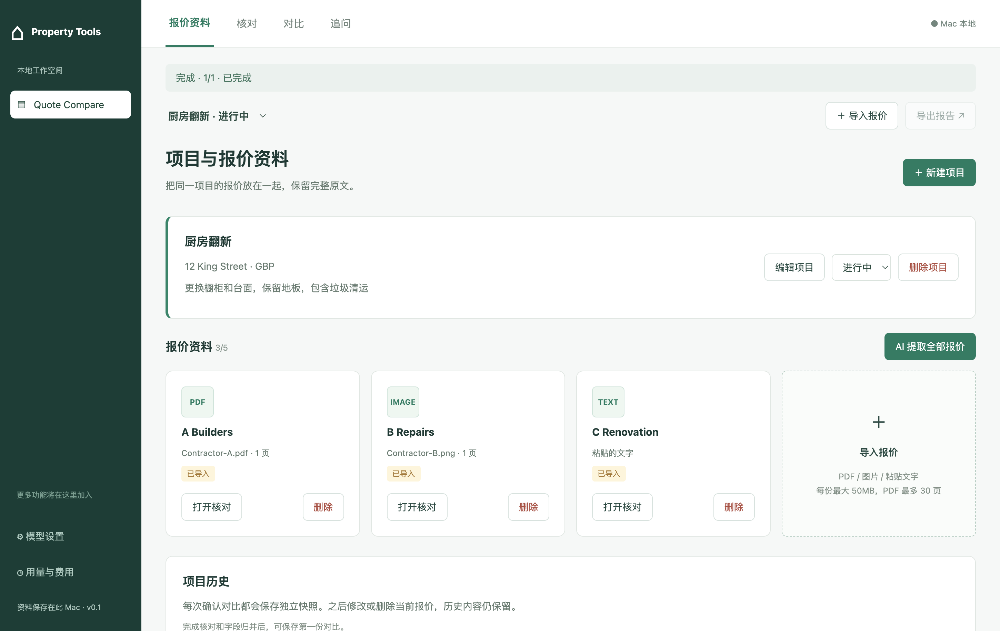
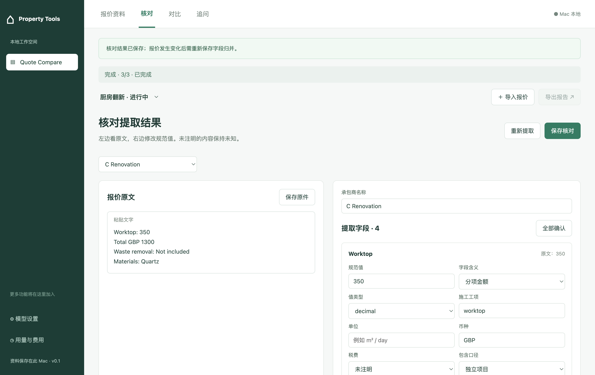
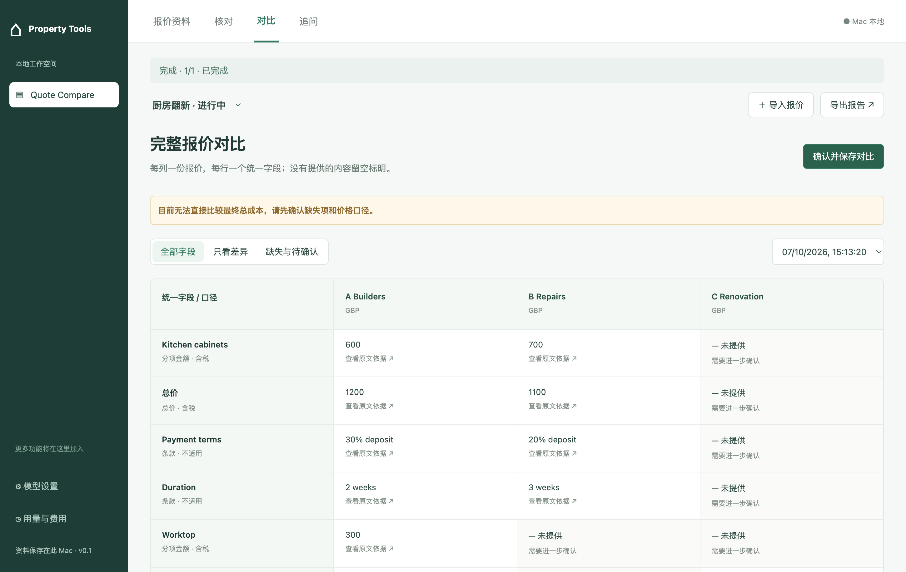
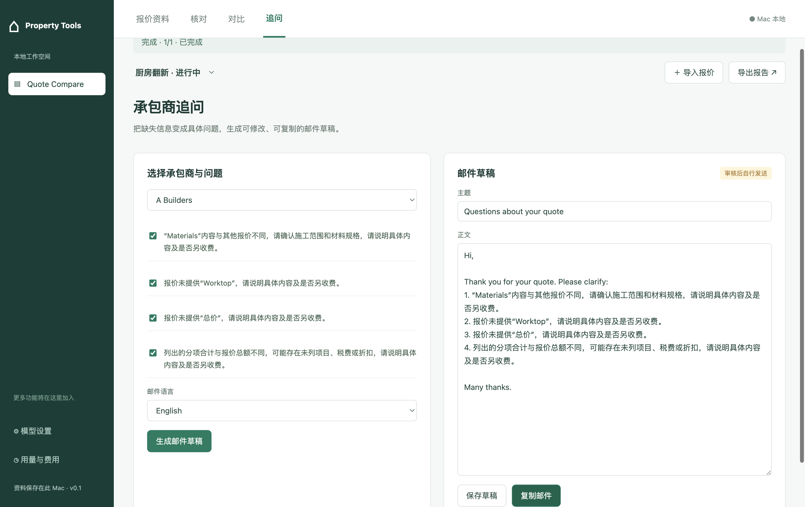
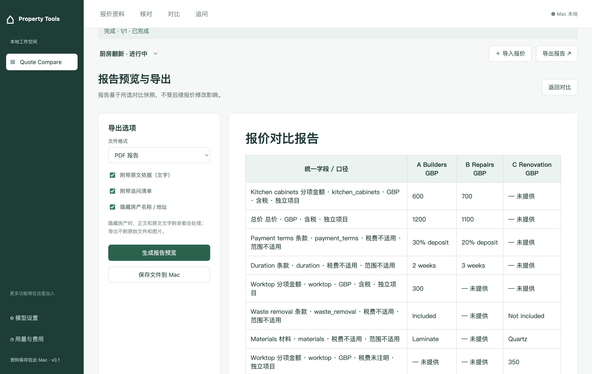
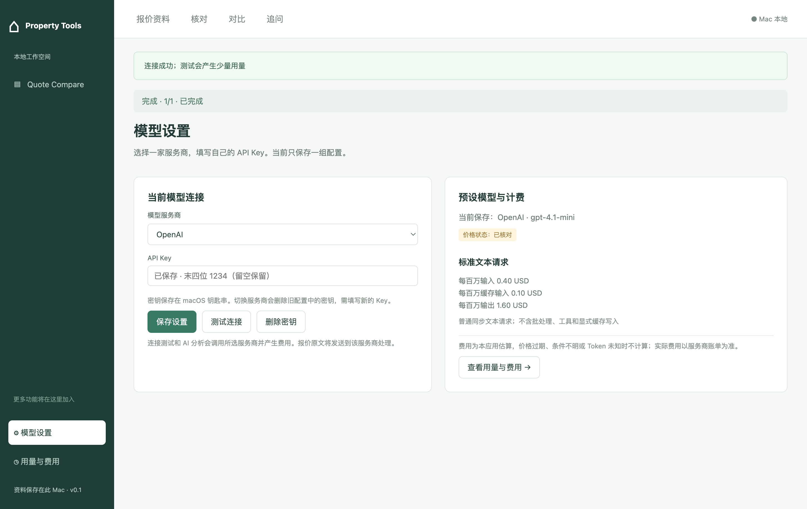
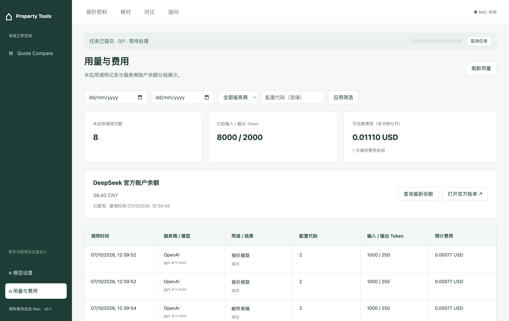

# QuoteCompare

给房东和物业经理使用的 Mac 本地装修／维修报价对比工具。

导入承包商报价 → AI提取 → 人工核对 → 统一字段对比 → 追问邮件和报告。项目、原文与报告保存在本机，API Key保存在 macOS钥匙串；AI分析需要网络及用户自己的模型API额度。

## 下载与使用

**[下载 Mac 应用](https://github.com/doinglaundry/quotecompare/releases/latest/download/QuoteCompare-mac-arm64.zip)** · [版本页面](https://github.com/doinglaundry/quotecompare/releases/latest)

公开下载，无需 GitHub账号、克隆仓库或安装 Python / Node.js。当前包适用于 **Apple Silicon Mac**，已在 macOS 15.7验证。

1. 下载ZIP并解压，将 `QuoteCompare.app` 放入“应用程序”后打开。
2. 在“模型设置”中选择 OpenAI、Claude 或 DeepSeek，填写API Key。
3. 新建项目、导入报价，核对后查看对比并导出报告。

v0.1.0存在签名缺陷，请下载v0.1.1或更新版本并替换旧App。新版通过完整签名校验，但尚无 Apple Developer ID及公证；如提示开发者无法验证，可按[Apple说明](https://support.apple.com/en-us/102445)在“系统设置 → 隐私与安全 → 仍要打开”确认。如仍提示“已损坏”，请反馈，不要直接绕过检查。

## 让智能体自动安装并启动

把下面整段交给能操作本机的智能体：

```text
请在我的Mac上自动安装并启动QuoteCompare，实际执行到窗口打开。
公开软件下载地址：
https://github.com/doinglaundry/quotecompare/releases/latest/download/QuoteCompare-mac-arm64.zip
SHA-256校验文件：
https://github.com/doinglaundry/quotecompare/releases/latest/download/SHA256SUMS.txt

确认系统是macOS arm64；下载ZIP和校验文件，校验通过后用ditto解压，
安装到~/Applications/并用open启动。已有可用应用优先复用，不覆盖用户数据。
启动进程若有ELECTRON_RUN_AS_NODE环境变量，先清除。
无需登录GitHub、克隆源码、安装开发依赖或配置后端。
确认能看到“项目与报价资料”并打开“模型设置”；启动失败自行排查并重试。
如果无法检查界面，明确说明已验证的状态，不假称启动成功。
系统要求首次打开授权时引导我确认，不关闭系统安全机制。
成功后保持应用运行，告诉我应用位置。API Key由我在界面填写，
不要替我调用付费模型或发送邮件。
```

## 功能页面

页面中的报价与用量为演示数据。

### 报价资料

创建项目，导入PDF、图片或文字报价；每项目最多五份。



### 核对

对照原文检查AI提取结果，修改并确认金额、材料和条款。



### 对比

按统一口径展示全部字段、差异和风险；缺失值标“未提供”，并保留历史快照。



### 追问

针对缺失信息生成中英文邮件草稿，可编辑、保存和复制。



### 报告预览与导出

预览报告并导出PDF / CSV，可选择附录内容或隐藏房产地址。



### 模型设置

选择OpenAI、Claude或DeepSeek并填写API Key；只保存当前连接，切换时删除旧密钥。



### 用量与费用

查看本应用调用、Token和估算费用，查询DeepSeek余额或打开官方账单。



## 源码开发

前端：JavaScript / React / Electron。后端：Python / FastAPI。存储：SQLite和本地文件。

需要macOS、Git、Node.js 22.12+、Python 3.14。在仓库根目录启动，Electron会自动启动后端并初始化数据库：

```sh
git clone https://github.com/doinglaundry/quotecompare.git
cd quotecompare
python3.14 -m venv .venv
.venv/bin/python -m pip install -r requirements-dev.txt
npm ci
npm start
```

测试与打包：

```sh
.venv/bin/python -m pytest backend/tests -q
.venv/bin/python tests/e2e/fixtures.py
npm run build
npm run test:coverage
npm run package
npm run test:packaged
```

Apple Silicon产物：`release/mac-arm64/QuoteCompare.app`。模型E2E使用受控HTTP服务，不代表真实账号的提取质量或扣费验证。

## 文档

- [PRD总览](docs/prd/QuoteCompare-PRD-overview-v3.pdf)
- [技术方案与接口](docs/technical/QuoteCompare-technical-design-v2.html)
- [测试结果与验证边界](docs/implementation/verification.md)
